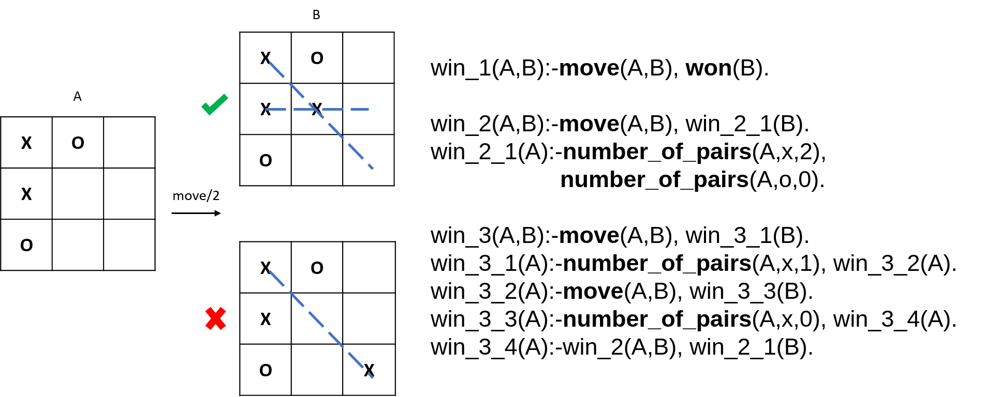
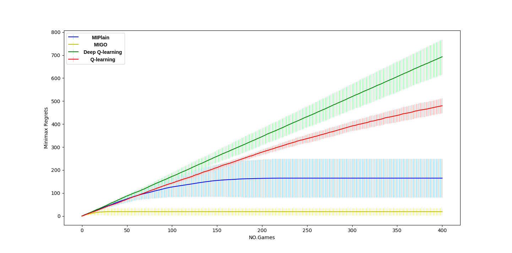
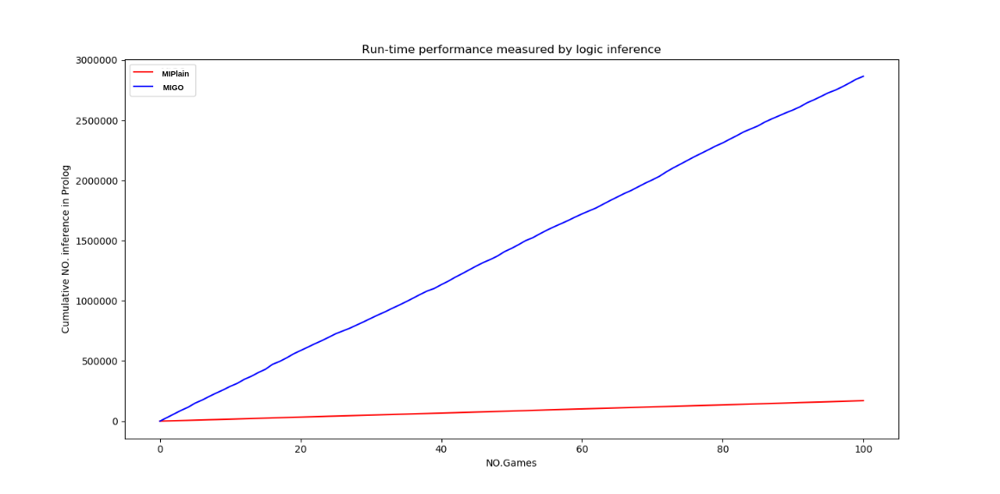
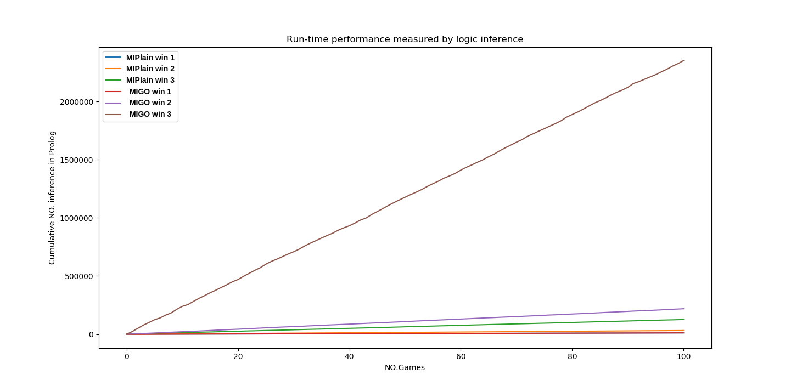

# Machine learning of Noughts-and-Crosses using MIL

We have devised a symbolic machine learning framework for learning to win the game of Noughts and Crosses. The purpose of this framework is to learn a logic theory which we can use to teach human beings such that their out-of-sample performance is improved as the result of teaching. This beneficial aspect of using machine learned model to aid human comprehension is known as one key criteria of the Ultra-Strong Machine Learning described by Donald Michie.

We incorporated the learned theory of this framework in empirical studies and investigated the explanatory effects of machine learned theory.
The explanatory effects of machine learned theory are defined by us as being beneficial or harmful. An operation definition relates to improvement or degradation of human out-of-sample performance after being provided a logic theory as an explanation.

**Meta-Interpretive Learning** (MIL) is an Inductive Logic Programming (ILP) approach in which recursive logic programs can be induced incrementally from a small number of examples together with background predicates and metarules.

MIPlain stands for **M**eta-**I**nterpretive ex**Plain**able game learner and is based on the Meta-interpretive game learning system MIGO (Muggleton and Hocquette 2019). In addition to learning from positive examples which MIGO does, MIPlain identifies moves which are negative examples for the task of winning. When a game is drawn or lost for the learner, the corresponding path in the game tree is saved for later backtracking following the most updated strategy. A selection of hypotheses is performed by MIPlain based on the efficiency of hypothesised programs using Metaopt (Cropper and Muggleton 2019).

MIPlain learns a Noughts-and-Crosses winning strategy which is more runtime efficient than the one learned by MIGO. MIPlain also achieves more efficient cumulative regrets during learning than MIGO, Deep Q-learning and classic Q-learning.

The following figure shows the logic program learned by MIPlain.

MIPlain uses three primitives (highlighted in the above figure):
1. move/2 for generating a valid Noughts and Crosses move
2. won/1 for deciding a win of Noughts and Crosses
3. number_of_pairs/3 for specifying the number of attacks for a player (X or O) on a given board. We have name such a game pattern "pair" because an attack involves two pieces of the same player but none of the opponent.

(win_3) winning first move for X = X moves + X has one attack + O moves + X will be blocked by O
                         + X then makes two attacks + O has no attack
                         
(win_2) winning second move for X = X moves + X has two attacks + O has no attack

(win_1) winning third move for X = X moves + X has three pieces in a line

## MIPlain implementation and evaluation

### Backtrack algorithm
- MIPlain_impl_and_eval/MIPlain/backtrack_and_replay.pl

### MIPlain meta-rules and feature primitives
- MIPlain_impl_and_eval/MIPlain/learning.pl

### MIPlain game playing enviroment
- MIPlain_impl_and_eval/MIPlain/environment.pl

### MIPlain learning (Metaopt and episode learning) extending MIGO
- MIPlain_impl_and_eval/MIPlain/MIGO/episode_learning.pl

- MIPlain_impl_and_eval/MIPlain/MIGO/assign_labels.pl

- MIPlain_impl_and_eval/MIPlain/MIGO/execute_strategy.pl

- MIPlain_impl_and_eval/MIPlain/MIGO/METAOPT/metaopt.pl

- MIPlain_impl_and_eval/MIPlain/MIGO/METAOPT/tree-costs.pl

### Learning efficiency evaluation
Q-Learing, DQN and MIGO are compared with MIPlain.

An implementation of Q-learning (Q-learning tic-tac-toe accessed 14 April, 2019) and 
an implementation of DeepQ-learning  (Solving  tic-tac-toe  using  deep  reinforcement 
learning. accessed  14  April,  2019) were used to learn how to win Noughts-and-Crosses 
as the player ”X” from the same set of 2-ply winnable boards as MIGO and MIPlain.  For each of the methods,
we accumulated regrets from each game, and the regret for each won,  drawn,  lost game is 0,  1,  2 respectively.
For Q-learning and Deep Q-learning, an illegal move is treated as a lost and the regret is 2.  
We set the state space to include a state for each cell of the board and an action is a move made by player ”X”. 
The DQN learner and the classical Q-Learning assume an optimal opponent for gameplay.  
We defined reward functions that heavily penalize invalid moves for both Q-Learning and DQN. 
We set discount factor to 0.9 for Q-learning and 0.8 for DQN. 
For DQN, we used a small learning rate  to  avoid  over-fitting and a simple fully-connected network (256,  64)  as  the  value  network. 
Both Q-Learning and DQN were given a set of initial boards for learning to ensure the best achievable outcome of gameplay is win.

- MIPlain_impl_and_eval/Deep_Q_learning/output/DQN.txt

- MIPlain_impl_and_eval/nandc_MIGO/output/MIGO.txt

- MIPlain_impl_and_eval/Q_learning/output/q.txt

- MIPlain_impl_and_eval/MIPlain/output/MIPlain.txt

### Run-time efficiency evaluation
The number of inference performed by MIGO and MIPlain learned program in 100 games (50 runs).
- MIPlain_impl_and_eval/MIPlain/output/inference.txt

The number of inference performed by win1, win2 and win3 predicates in MIGO learned program in 100 games (50 runs).
- MIPlain_impl_and_eval/MIPlain/output/rule_wise_inference_MIGO.txt

The number of inference performed by win1, win2 and win3 predicates in MIPlain learned program in 100 games (50 runs).
- MIPlain_impl_and_eval/MIPlain/output/rule_wise_inference_MIPlain.txt

## MIPlain local usage
Requirement: SWI-Prolog version => 7

Change to directory MIPlain_impl_and_eval/MIPlain/

run `swipl -s backtrack_and_replay.pl -g goal -t halt`

## Repository composition
In the following section, we describe the compositions of this repository for reader reference.
Details of the arrangement are be discussed. If interested about additional information and raw empirical data of experiments, please find the contact of author at the page bottom.

### Minimax database (not required to reproduce for MIPlain local use)
- minimax/canonical_map.m

- minimax/data.m

- minimax/minimax_DB.py (functions for creating database, visualization and conversion to JS)

## experiment interfaces
This sub folder is consisted of experiment interfaces realised by HTML and JavaScript.
We have used different versions for multiple experiment setups and progressively improved the interfaces.
- Version 1: Test Experiment
- Version 2 - 3: Noughts and Crosses experiments
- Version 4 - 5: Experiments concerning a two players game that is isomorphic to Noughts and Crosses.

We have introduced an isomorphic two players game to increase the difficulty of the gameplay by preventing analogical access to past experience of Noughts and Crosses.
The Island Game contains three islands, each with three territories on which one or more resources are marked. The winning condition is met when a player either controls all territories on one island or three instances of the same resource.The nine territories resemble the nine fields in Noughts and Crosses and the structure of the original game is maintained in regard to players’ turns, possible moves, board states and win conditions. This isomorphism masks a number of spatial relations representing the membership of a field to a win condition. In this way, the fields canbe rearranged in an arbitrary order without changing the structure of the game.

### Generating explanation

#### test experiment
- explanation/translation.py

#### 2nd experiment
1.locate to 'explanation'

2.Start SWI Prolog session in terminal

3.Consult in interactive Prolog mode, `consult(loader).`

4.Examples are given in explanation/sl_background_features 
and explanation/sl_migo

5.To add targets, `add_target(rule_name).`

6.To start generating explanation, `interpret_program.`

## Author contact
For any question or query, please email **lun.ai15@imperial.ac.uk**.
The author will try to reply as soon as available.

## References

Muggleton, Stephen and Celine Hocquette (2019). “Machine Discovery of Comprehensible Strategies for Simple Games Using Meta-
interpretive Learning”. In: New Generation Computing 37.2, pp. 203–217.

Cropper, Andrew and Muggleton, Muggleton (2019). Learning efficient logic programs. In: Machine Learning, 108:1063–1083.

Q-learning tic-tac-toe(accessed 14 April, 2019). url:https://gist.github.com/fheisler/430e70fa249ba30e707f.

Solving  tic-tac-toe  using  deep  reinforcement  learning.(accessed 14 April, 2019).url:https://github.com/yanji84/tic-tac-toe-rl.