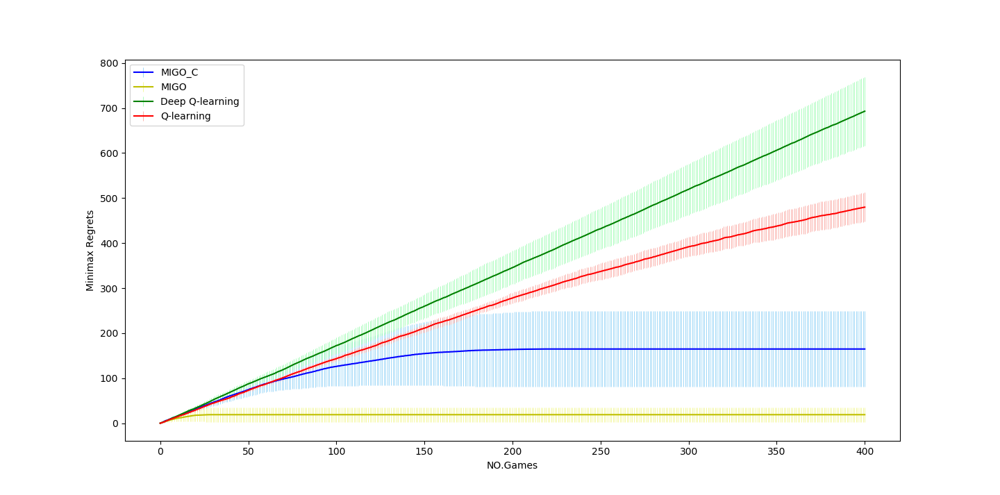
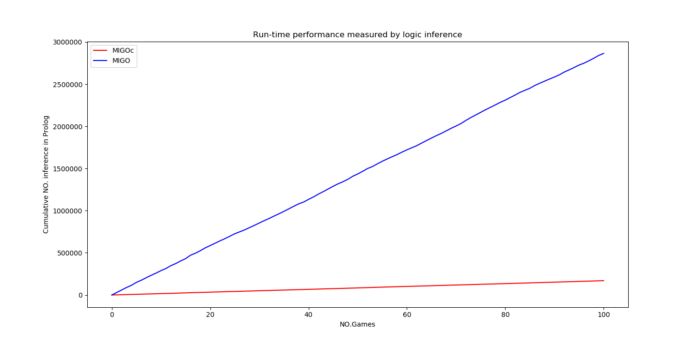

# Ultra-Strong Machine Learing in Noughts-and-Crosses using MIL 

## MIGOc implementation and evaluation

### Backtrack algorithm
- MIGOc_impl_and_eval/MIGOc/backtrack_and_replay.pl

### MIGOc meta-rules and feature primitives
- MIGOc_impl_and_eval/MIGOc/learning.pl

### MIGOc game playing enviroment
- MIGOc_impl_and_eval/MIGOc/environment.pl

### MIGOc learning (Metaopt and episode learning) extending MIGO
- MIGOc_impl_and_eval/MIGOc/MIGO/episode_learning.pl

- MIGOc_impl_and_eval/MIGOc/MIGO/assign_labels.pl

- MIGOc_impl_and_eval/MIGOc/MIGO/execute_strategy.pl

- MIGOc_impl_and_eval/MIGOc/MIGO/METAOPT/metaopt.pl

- MIGOc_impl_and_eval/MIGOc/MIGO/METAOPT/tree-costs.pl

### Learning efficiency evaluation
Q-Learing, DQN and MIGO are compared with MIGOc.

An implementationof Q-learning (Q-learning tic-tac-toeaccessed 14 April, 2019) and 
an implementation of DeepQ-learning  (Solving  tic-tac-toe  using  deep  reinforcement 
learning.accessed  14  April,  2019) were used to learn how to win Noughts-and-Crosses 
as ”X” from the same set of 2-ply winnableboards asMIGOandMIGOC.  For each of the methods, 
we accumulated regrets from eachgame,  and the regret for each won,  drawn,  lost game is 0,  1,  2 respectively.  
For Q-learningand Deep Q-learning, an illegal move is treated as a lost and the regret is 2.  
We set the statespace to include a state for each cell of the board and an action is a move made by player ”X”. 
The DQN learner and the classical Q-Learning assume an optimal opponent for gameplay.  
We defined reward functions that heavily penalize invalid moves for both Q-Learning and DQN. 
We set discount factor to 0.9 for Q-learning and 0.8 for DQN. 
For DQN, we used a small learningrate  to  avoid  over-fitting  and  three  fully-connected  layers  (256,  64,  9)  as  the  value  network. 
Both Q-Learning and DQN were given a set of initial boards for learning to ensure the bestachievable outcome of gameplay is win.

- MIGOc_impl_and_eval/Deep_Q_learning/output/DQN.txt

- MIGOc_impl_and_eval/nandc_MIGO/output/MIGO.txt

- MIGOc_impl_and_eval/Q_learning/output/q.txt

- MIGOc_impl_and_eval/MIGOc/output/MIGO_with_features.txt

### Run-time efficiency evaluation
- MIGOc_impl_and_eval/MIGOc/output/inference.txt

- MIGOc_impl_and_eval/MIGOc/output/.txt

- MIGOc_impl_and_eval/MIGOc/output/inference.txt

## MIGOc usage
Requirement: SWI-Prolog version => 7

Change to directory MIGOc_impl_and_eval/MIGOc/

run `swipl -s backtrack_and_replay.pl -g goal -t halt`

## Minimax database
- minimax/canonical_map.m

- minimax/data.m

- minimax/minimax_DB.py (functions for creating database, visualization and conversion to JS)

## Interface V1 (Test Experiment)
### Using database with html via js
Run Python binary_to_JS() in ./minimax_DB.py to generate js usable minimax database

- html_interface/scripts/canonicalMap.js

- html_interface/scripts/data.js

- html_interface/scripts/partitions.js

- html_interface/scripts/partitions15000.js

- html_interface/scripts/partitions15000_parsed.js

### Introduction page
- html_interface/index.html

### Experiment session interface and control
- html_interface/experiment.html

- html_interface/scripts/init.js

- html_interface/scripts/minimax.js

- html_interface/scripts/noughts-and-crosses.js

- html_interface/scripts/questions.js

- html_interface/scripts/utils.js

- html_interface/scripts/variables.js

## Interface V2 & V3 (Second Experiment)
### Experiment session interface and control
- html_interface_v2/index.html

- html_interface_v2/phase1.html

- html_interface_v2/phase2-4.html

- html_interface_v2/submission.html

- html_interface_v2/scripts/~

### Generating explanation

#### test experiment
- explanation/translation.py

#### 2nd experiment
1.locate to 'explanation'

2.Start SWI Prolog session in terminal

3.Consult in interactive Prolog mode, `consult(loader).`

4.Examples are given in explanation/sl_background_features 
and explanation/sl_migo

5.To add targets, `add_target(rule_name).`

6.To start generating explanation, `interpret_program.`

### Collected records
- records_test (test experiment)
- records

